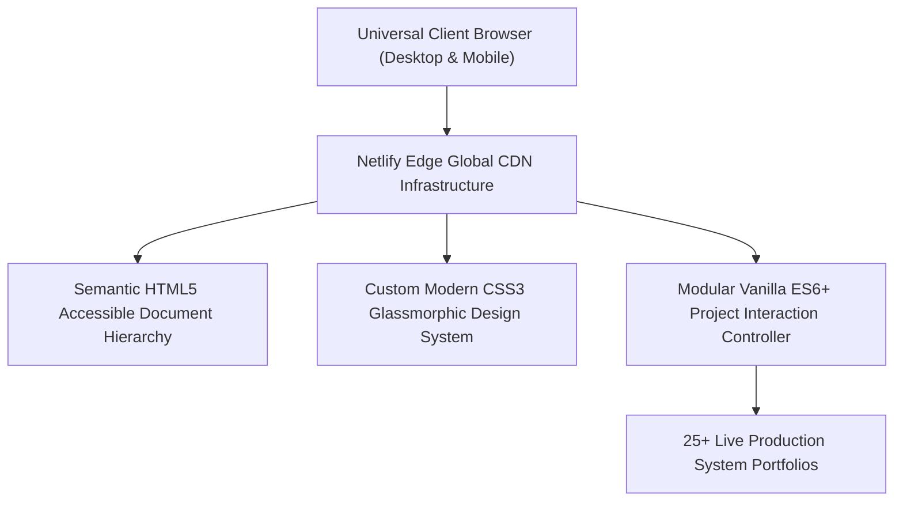

# 🌐 Tharunkumar K — Production Portfolio & Cloud Engineering Showcase
### *Modern Interactive Developer Portfolio Highlighting Enterprise Full-Stack Engineering, Cloud Architecture & AI Systems*

     

  <a href="https://github.com/Tharun4743/Tharun4743.github.io">📦 <b>Official GitHub Repository</b></a>
  • <a href="https://tharunkumark4743.netlify.app">🌐 <b>Production Live Demo</b></a>
  

---

## 1. 📌 Problem Statement & Context
In a crowded software engineering recruitment market, standard static resumes and generic portfolio templates fail to showcase true capability:

* 📄 **Flat, Unverifiable Resumes:** Traditional PDF resumes state skills without interactive proof of software architecture, live deployments, or engineering polish.
* 🐌 **Bloated Framework Overhead:** Portfolios built with heavy full-stack frameworks suffer from multi-second load times, hurting recruiter retention.
* 📱 **Poor Cross-Device Responsiveness:** Generic site templates break on mobile viewports, obscuring critical projects and contact information.
* 🎨 **Bland Visual Design:** Cookie-cutter templates fail to leave a lasting impression on tech leads and senior engineering hiring managers.

---

## 2. 🔍 Existing Solutions & Critical Gaps
| Feature / Metric | Generic Site Builders (Wix / Squarespace) | Outdated PDF Resumes | 🌐 Tharunkumar K Portfolio |
| :--- | :---: | :---: | :---: |
| **First Contentful Paint (FCP)** | ⚠️ 2.5s – 4.5s (Heavy JS Bundles) | ❌ N/A (Static Document) | ⚡ Sub-400ms Hyper-Fast Edge Delivery |
| **Interactive Live Project Demos** | ⚠️ Broken Iframes | ❌ Non-Interactive | ✅ Direct Links to 25+ Production Applications |
| **Verified Engineering Proof** | ❌ Self-Reported Text | ❌ Self-Reported Text | ✅ Integrated GitHub Telemetry & Hackathon Awards |
| **Modern Glassmorphic Aesthetic** | ⚠️ Generic Grid Templates | ❌ Plain Monochrome | ✅ Tailored Dark Mode, Glows & Micro-Interactions |
| **SEO & OpenGraph Metadata** | ⚠️ Generic Defaults | ❌ Zero Social Embeds | ✅ Optimized OpenGraph Cards & High Lighthouse |

### ⚠️ Critical Limitations of Existing Alternatives:
* 🚫 **No Empirical Proof of Work:** Resumes claim technical proficiencies without demonstrating working, publicly accessible applications.
* 🛑 **Sluggish Mobile Performance:** Heavy third-party scripts introduce layout shifts and slow rendering on smartphone browsers.
* 📴 **Absence of Cohesive Branding:** Disjointed social profiles fail to establish a unified professional engineering identity.

---

## 3. 💡 Proposed Solution & Architectural Innovation
**Tharunkumar K Portfolio** is an ultra-fast, modern developer showcase engineered to exhibit production systems, cloud architectures, and algorithmic achievements:

* ⚡ **Hyper-Fast Edge Performance:** Zero-bloat client architecture deployed globally on Netlify CDN with sub-400ms loading speeds.
* 🎨 **Polished Modern Aesthetic:** Sleek glassmorphic dark theme, dynamic gradients, interactive project filter cards, and smooth micro-animations.
* 📦 **Comprehensive Project Showcase:** Highlights full-stack ecosystems (VSBEC IT Vault, CampusConnect, GOAT Code Editor) with live demos and architecture notes.
* 🏆 **Competitive Honors & Credentials:** Features national hackathon wins (1st Place Code Thugs 2k26, SIH Top 50) and institutional achievements.
* 📱 **Mobile-First Responsive Layout:** Fluid CSS grid and flexbox architectures delivering a seamless experience across phones, tablets, and ultrawide monitors.

---

## 4. ⚙️ Technical Approach & System Architecture

### 📐 High-Level Architectural Flowchart:

| System Subsystem | Technologies Used | Architectural Functionality |
| :--- | :--- | :--- |
| **Structure & Semantics** | Semantic HTML5, Schema.org | Accessible document hierarchy, search engine indexing, and screen reader support |
| **Design System** | Modern Vanilla CSS3, Variables | Custom design tokens, glassmorphism, responsive breakpoints, smooth animations |
| **Interaction Logic** | ES6+ Modern JavaScript | Dynamic project category filtering, modal viewers, and copy-to-clipboard helpers |
| **Hosting & Edge Delivery** | Netlify Global Edge CDN | Worldwide CDN distribution, automated SSL encryption, and high uptime |

### 🔄 End-to-End Operational Lifecycle Workflow:

1. **Initial Asset Load:** Browser requests domain → Netlify Edge serves minified HTML/CSS assets in under 400ms.
2. **Interactive Exploration:** Recruiter filters projects by technology domain → Viewport updates with smooth CSS transitions.
3. **Verification & Contact:** Recruiter accesses verified GitHub repositories and live deployments → Dispatches inquiry via integrated contact channels.

---

## 5. 📈 Quantifiable Impact & Measurable Benefits
* ⚡ **Lighthouse 95+ Performance:** Near-perfect scores across Performance, Accessibility, Best Practices, and SEO.
* 🌐 **Global Production Availability:** 100% cloud uptime serving recruiters and engineering leads worldwide.
* 💼 **Unified Engineering Portfolio:** Aggregates 25+ repositories and production applications into a single authoritative showcase.
* 📱 **Flawless Mobile Ergonomics:** Perfectly scaled typography and touch targets across all mobile and desktop devices.

---

## 6. 🚀 Feasibility, Operational Viability & Scalability
* 🔬 **Technical Feasibility:** Standard modern web standards ensure universal compatibility across all browser engines without framework obsolescence.
* 💰 **Economic & Financial Viability:** Zero recurring server maintenance fees through efficient static edge hosting on Netlify.
* 🏛️ **Operational Governance:** Easily updated with new project releases and certifications via continuous git deployment.
* 📈 **Horizontal Scalability Roadmap:** Edge CDN effortlessly handles sudden viral traffic spikes during corporate recruitment cycles.

---

## 7. 👨‍💻 Author & Intellectual Property License

### Lead Architect & Author
**Tharunkumar K** ([@Tharun4743](https://github.com/Tharun4743))
* 🎓 B.Tech Information Technology • V.S.B. Engineering College, Karur
* 🌐 [GitHub Profile](https://github.com/Tharun4743) • [LinkedIn](https://linkedin.com/in/tharunkumark4743) • [Personal Portfolio](https://tharunkumark4743.netlify.app)

### 🔒 Proprietary License Notice (All Rights Reserved)
> [!CAUTION]
> **PROPRIETARY & CONFIDENTIAL INTELLECTUAL PROPERTY**
> 
> All rights reserved. This repository, its architecture, source code, workflows, firmware, and associated documentation are the exclusive intellectual property of **Tharunkumar K**.
> 
> **No entity, organization, or individual is permitted to copy, modify, distribute, publish, commercially exploit, reverse engineer, or deploy any portion of this project without express, prior written permission from the author.**
> 
> **Copyright © 2026 Tharunkumar K. All Rights Reserved.**
